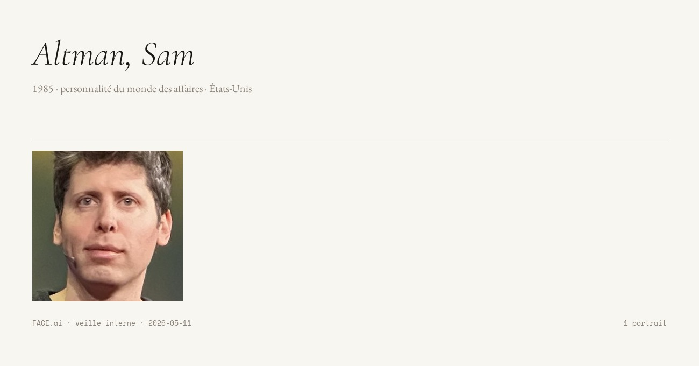

# FACE.ai

> Outil de veille interne sur corpus maîtrisé d'articles de presse,
> avec dimension artistique assumée (Flipbook, composite Galton,
> esthétique forensique-musée). Satellite de [WUDD.ai](https://wudd.ai).

FACE.ai aspire les images de personnalités publiques mentionnées dans
les articles passés par WUDD.ai, exécute une détection + alignement
facial (MediaPipe + OpenCV + InsightFace/ArcFace), et expose le corpus
via une galerie React et un serveur MCP (Claude Desktop / Claude Code).

**Ce projet n'est pas** un outil de surveillance de masse, ni un SaaS,
ni un projet de recherche académique généraliste. Le ciblage `PERSON`
se limite aux personnalités publiques apparaissant dans la presse —
intérêt légitime (RGPD art. 6.1.f, nLPD CH art. 31). Voir
[COMPLIANCE.md](COMPLIANCE.md) pour le registre RGPD/nLPD complet.

---

## Aperçu



| Bloc | Stack |
|---|---|
| Backend API | FastAPI + SQLAlchemy + SQLite + Alembic |
| Worker | Python (boucles `merge`, `wudd_sync`, `wudd_articles_batch`, `backup`) |
| Vision | MediaPipe FaceMesh (478 landmarks), OpenCV, InsightFace `buffalo_s` (ArcFace 512-dim) |
| Déduplication | pHash DCT 64-bit (perceptual hash) |
| Frontend | React 18 + Vite + Tailwind + TanStack Query |
| MCP server | `mcp` Python SDK (mode SSE + stdio) |
| Search | SQLite FTS5 (`unicode61 remove_diacritics 2`) |

Pipeline : `WUDD article → scraper → SQLite → face_processor → API/MCP → React`.

---

## Démarrage

Prérequis : Docker + Docker Compose. Tout tourne en conteneurs.

```bash
cp .env.example .env
docker compose up
```

- API : http://127.0.0.1:8010
- Frontend : http://127.0.0.1:5173
- MCP (SSE) : http://127.0.0.1:8011/sse

Le worker télécharge les modèles InsightFace (~120 MB) au premier
appel dans `/root/.insightface` (monté en volume `models/insightface_home/`).

### Tests

```bash
docker compose exec api pytest -v
docker compose exec frontend npm run test
```

Cibles couverture : backend 80 %, frontend 60 %.

---

## Brancher Claude Code / Claude Desktop sur le MCP

Voir [`claude_mcp_config.example.json`](claude_mcp_config.example.json)
pour les deux modes (SSE recommandé pour LAN/Tailscale, stdio pour
exécution locale).

Tools MCP exposés :

| Tool | Usage |
|---|---|
| `get_corpus_stats` | Vue d'ensemble (totaux, top entités, pose distribution) |
| `search_entities` | Recherche FTS5 multi-tokens, multilingue, sans accents |
| `get_entity_profile` | Fiche briefable (bio Wikidata, dates, pays, occupations) |
| `get_entity_images` | Images filtrées par pose, unicité, date |
| `compare_entities` | Cooccurrences éditoriales entre deux entités |
| `get_media_timeline` | Histogramme temporel d'apparition |
| `analyze_visibility_pattern` | Pré-mâché LLM (profil + timeline + titres) |
| `list_favorites`, `list_flagged_images`, `list_flagged_by_period` | Audit |
| `find_duplicate_candidates` | Doublons pHash |

---

## Conventions architecturales

Choix non-évidents à conserver — détaillés dans
[CLAUDE.md](CLAUDE.md) et [FACE-ai-specification.md](FACE-ai-specification.md) :

- **Docker-first.** Pas de "j'installe Python en local".
- **LAN/Tailscale uniquement.** Pas d'auth applicative, le réseau est
  le périmètre. Tous les ports bindent `127.0.0.1`.
- **Deux pipelines visuels distincts.** pHash pour la dédup (mêmes
  images redistribuées), ArcFace pour l'identité (même personne).
- **La DB ne contient que des portraits valides** (§5.4) : pas de
  statut `failed`/`no_face`, purge silencieuse à l'ingestion.
- **Pull-only WUDD.** Pas de mode push.
- **Compteurs dénormalisés** maintenus par `entity_stats.recompute_counts`.
- **Garde-fou anti-fusion catastrophique** (incident 2026-05-11) :
  `auto_merge_by_qid` refuse une fusion qui ferait grossir le canonical
  de > 1.5×, ou si un Wikidata score < 1.0.
- **Fusion par centroïde ArcFace** pour les homonymes Wikidata.
- **Backup automatique** quotidien avec restore via UI Admin.
- **Frontend sans-serif système** pour l'UI ; Cormorant/Garamond
  réservés à l'export JPG.

---

## Documentation

| Fichier | Quoi |
|---|---|
| [FACE-ai-specification.md](FACE-ai-specification.md) | Spec canonique de conception |
| [CLAUDE.md](CLAUDE.md) | Conventions et garde-fous (lecture obligatoire avant contribution) |
| [ROADMAP.md](ROADMAP.md) | État du projet et travaux à venir |
| [SPEC_AUDIT.md](SPEC_AUDIT.md) | Audit divergences spec ↔ code |
| [COMPLIANCE.md](COMPLIANCE.md) | Registre RGPD / nLPD CH |
| [MIGRATION_POSTGRES.md](MIGRATION_POSTGRES.md) | Plan de scale au-delà de 100k images |
| [MCP_TEST_PROMPTS.md](MCP_TEST_PROMPTS.md) | Suite de tests MCP en langage naturel |

---

## Licence

Code source : [AGPL-3.0](LICENSE) — GNU Affero General Public License v3.

Le code peut être étudié, modifié et redistribué librement, mais tout
déploiement en service réseau impose la mise à disposition du code
source modifié aux utilisateurs.

**Licences tierces** :
- Polices `models/fonts/*.ttf` : SIL Open Font License 1.1
  (cf. [`models/fonts/OFL.txt`](models/fonts/OFL.txt))
- Modèles InsightFace `buffalo_s` : voir
  [InsightFace](https://github.com/deepinsight/insightface)
- Données Wikidata / Wikimedia : CC0 / CC BY-SA selon contenu

**Données du corpus** : aucune image, aucun article et aucune base
SQLite n'est publié sur ce dépôt. Le corpus reste local au déploiement.

---

## Contact

Responsable : Patrick Ostertag — `contact@ok-ia.ch`
Pour les questions RGPD/nLPD, voir [COMPLIANCE.md §8](COMPLIANCE.md).
